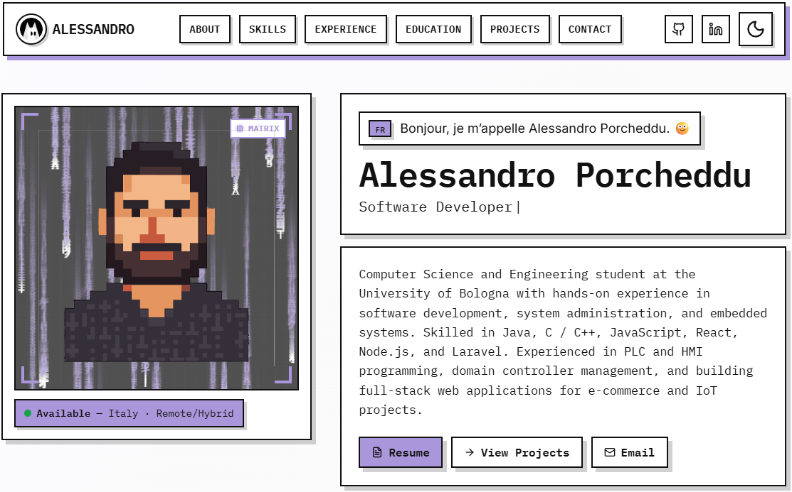

# 🎨 Modern Portfolio Template

A stunning, fully customizable portfolio website template with a brutalist design aesthetic. Perfect for developers, designers, and creative professionals looking to showcase their work.



## ✨ Features

- **🎯 Modern Design**: Bold, brutalist-inspired aesthetic with geometric shapes and strong typography
- **📱 Fully Responsive**: Mobile-first design that looks great on all devices
- **⚡ Performance Optimized**: Fast loading with lazy loading, code splitting, and efficient animations
- **♿ Accessible**: WCAG compliant with keyboard navigation support and screen reader friendly
- **🎨 Customizable**: Easy-to-edit data files for quick personalization
- **📧 Contact Form**: Integrated with Formspree for hassle-free contact form handling
- **📄 Resume Viewer**: Built-in resume modal with PDF download functionality
- **🎭 Interactive Elements**: Animated logo, typewriter effects, and custom canvas backgrounds

## 🛠️ Tech Stack

- **Frontend Framework**: React 19
- **Build Tool**: Vite 7
- **Styling**: Tailwind CSS + Custom CSS
- **Icons**: React Icons, Lucide React
- **Animations**: Framer Motion
- **Form Handling**: Formspree
- **Deployment**: Vercel / Netlify / GitHub Pages

---

## 🚀 Quick Start Guide

### Prerequisites

Before you begin, make sure you have installed:
- [Node.js](https://nodejs.org/) (v18 or higher)
- [Git](https://git-scm.com/)
- A code editor (VS Code recommended)

### Step 1: Clone or Download

**Option A: Clone with Git**
```bash
git clone https://github.com/yourusername/portfolio-template.git
cd portfolio-template
```

**Option B: Download ZIP**
1. Click the green "Code" button on GitHub
2. Select "Download ZIP"
3. Extract the ZIP file to your desired location
4. Open the folder in your terminal

### Step 2: Install Dependencies

```bash
npm install
```

This will install all required packages (~2-3 minutes).

### Step 3: Start Development Server

```bash
npm run dev
```

Your portfolio will open at `http://localhost:5173` 🎉

---

## 📝 Customization Guide

### 1. Personal Information

**Edit: `src/constants/config.js`**

This is the most important file! Update it with your information:

```javascript
export const SITE_CONFIG = {
  name: "Your Full Name",              // Replace with your name
  title: "Your Professional Title",    // e.g., "Full-Stack Developer"
  location: "Your City, Country",
  email: "your.email@example.com",
  
  social: {
    github: "https://github.com/yourusername",
    linkedin: "https://www.linkedin.com/in/your-profile/",
    portfolio: "https://yourportfolio.com/",
  },
  // ... more settings
};
```

### 2. Projects

**Edit: `src/data/projects.js`**

Add your projects to showcase:

```javascript
export const FEATURED_PROJECTS = [
  {
    id: 1,
    title: "Your Amazing Project",
    subtitle: "Brief tagline",
    blurb: "Detailed description of what your project does...",
    tech: ["React", "Node.js", "MongoDB"],
    image: "/your-project-screenshot.png",  // Add image to /public folder
    video: null,  // Optional video URL
    repo: "https://github.com/yourusername/your-project",
    demo: "https://your-project.vercel.app",
  },
  // Add more projects...
];
```

**Adding Project Images:**
1. Place your screenshots in the `/public` folder
2. Recommended size: 1200x800px or 16:9 aspect ratio
3. Use descriptive filenames (e.g., `ecommerce-project.png`)
4. Reference them with `/` prefix: `image: "/ecommerce-project.png"`

### 3. Skills

**Edit: `src/data/skills.js`**

Customize your skills with icons from [React Icons](https://react-icons.github.io/react-icons/):

```javascript
import { FaReact, FaNodeJs } from "react-icons/fa";

export const skills = [
  {
    icon: <FaReact className="text-sky-500" />,
    name: "React",
    desc: "Component-based UIs",
  },
  // Add your skills...
];
```

### 4. Resume

**Step 1: Add Your Resume PDF**
- Place your resume PDF in the `/public` folder
- Rename it to something like `YourName-Resume.pdf` (no spaces!)

**Step 2: Update Configuration**

Edit `src/components/Resume.jsx` (lines 12-17):
```javascript
const RESUME_URL = "/YourName-Resume.pdf";
const DOWNLOAD_NAME = "YourName-Resume.pdf";
```

**Step 3: Update Resume Content** (Optional)

The Resume component also shows a visual preview. Update the content starting at line 127 with your information.

### 5. Contact Form

**Setup Formspree:**

1. Go to [Formspree.io](https://formspree.io/) and create a free account
2. Create a new form and copy your endpoint URL
3. Edit `src/constants/config.js`:
   ```javascript
   contact: {
     formspreeEndpoint: "https://formspree.io/f/your-form-id",
   }
   ```

### 6. Images & Assets

**Profile Image:**
- Replace `/public/your-portrait.svg` with your photo
- Update references in `src/components/About.jsx`

**Logo:**
- Replace the BatCat logo components if desired
- Or keep them for a unique branding!

**Favicon:**
- Replace `/public/batcat.svg` with your favicon

### 7. Colors & Styling

**Edit: `src/index.css`**

Customize the color scheme by updating CSS variables:

```css
:root {
  --bg: #ffffff;           /* Background color */
  --fg: #111111;           /* Text color */
  --accent: #ffd600;       /* Accent color (yellow by default) */
  --border: #111111;       /* Border color */
}
```

**Change Accent Color Example:**
```css
--accent: #ff6b6b;  /* Red */
--accent: #4ecdc4;  /* Teal */
--accent: #a78bfa;  /* Purple */
```

---

## 🌐 Deployment Guide

### Deploy to Vercel (Recommended - Easiest!)

1. **Push your code to GitHub:**
   ```bash
   git init
   git add .
   git commit -m "Initial commit"
   git branch -M main
   git remote add origin https://github.com/yourusername/your-portfolio.git
   git push -u origin main
   ```

2. **Deploy to Vercel:**
   - Go to [vercel.com](https://vercel.com)
   - Click "Add New Project"
   - Import your GitHub repository
   - Vercel will auto-detect Vite settings
   - Click "Deploy"
   - Done! Your site will be live at `your-project.vercel.app`

3. **Custom Domain (Optional):**
   - Go to Project Settings → Domains
   - Add your custom domain
   - Update DNS records as instructed

### Deploy to Netlify

1. **Build your project:**
   ```bash
   npm run build
   ```

2. **Deploy via Netlify CLI:**
   ```bash
   npm install -g netlify-cli
   netlify login
   netlify deploy --prod
   ```

   Or drag the `dist` folder to [netlify.com/drop](https://app.netlify.com/drop)

### Deploy to GitHub Pages

1. **Install gh-pages:**
   ```bash
   npm install --save-dev gh-pages
   ```

2. **Update `package.json`:**
   ```json
   {
     "homepage": "https://yourusername.github.io/your-repo-name",
     "scripts": {
       "predeploy": "npm run build",
       "deploy": "gh-pages -d dist"
     }
   }
   ```

3. **Update `vite.config.js`:**
   ```javascript
   export default defineConfig({
     base: '/your-repo-name/',
     // ... rest of config
   })
   ```

4. **Deploy:**
   ```bash
   npm run deploy
   ```

---

## 📂 Project Structure

```
portfolio-template/
├── public/                    # Static assets
│   ├── batcat.svg            # Favicon
│   ├── your-portrait.svg     # Your profile image
│   ├── YourName-Resume.pdf   # Your resume
│   └── [project-images].png # Project screenshots
├── src/
│   ├── components/           # React components
│   │   ├── About.jsx         # About section
│   │   ├── Projects.jsx      # Projects showcase
│   │   ├── Skills.jsx        # Skills display
│   │   ├── Contact.jsx       # Contact form
│   │   ├── Navbar.jsx        # Navigation
│   │   └── ...
│   ├── data/                 # ⭐ Edit these files!
│   │   ├── projects.js       # Your projects data
│   │   ├── skills.js         # Your skills data
│   │   └── README.md         # Data customization guide
│   ├── constants/            # ⭐ Edit this too!
│   │   └── config.js         # Site configuration
│   ├── utils/
│   ├── hooks/
│   ├── App.jsx               # Main app component
│   ├── main.jsx              # Entry point
│   └── index.css             # Global styles
├── .gitignore
├── package.json
├── vite.config.js
├── tailwind.config.js
└── README.md                 # You're here!
```

## 🎯 Customization Checklist

Before deploying, make sure you've updated:

- [ ] Personal information in `src/constants/config.js`
- [ ] Projects in `src/data/projects.js`
- [ ] Skills in `src/data/skills.js`
- [ ] Resume PDF in `/public` folder
- [ ] Resume component references
- [ ] Formspree endpoint for contact form
- [ ] Profile image/portrait
- [ ] Favicon (`/public/batcat.svg`)
- [ ] Meta tags in `index.html`
- [ ] GitHub repository links
- [ ] Social media links
- [ ] About section content
- [ ] Color scheme (if desired)

## 🐛 Troubleshooting

### Issue: "Module not found" errors

**Solution:**
```bash
rm -rf node_modules package-lock.json
npm install
```

### Issue: Port 5173 already in use

**Solution:**
```bash
# Windows
netstat -ano | findstr :5173
taskkill /PID [PID_NUMBER] /F

# Mac/Linux
lsof -ti:5173 | xargs kill
```

Or change the port in `vite.config.js`:
```javascript
export default defineConfig({
  server: {
    port: 3000
  }
})
```

### Issue: Images not loading

**Solution:**
- Ensure images are in the `/public` folder
- Use `/` prefix: `image: "/my-image.png"`
- Check file extensions match exactly
- Restart dev server after adding images

### Issue: Formspree not working

**Solution:**
1. Verify your Formspree endpoint in `config.js`
2. Check that the form is deployed (Formspree requires a live URL)
3. Test the form on your deployed site, not localhost

## 📚 Learn More

- **React Documentation**: [react.dev](https://react.dev)
- **Vite Documentation**: [vitejs.dev](https://vitejs.dev)
- **Tailwind CSS**: [tailwindcss.com](https://tailwindcss.com)
- **React Icons**: [react-icons.github.io](https://react-icons.github.io/react-icons/)
- **Formspree**: [formspree.io/docs](https://help.formspree.io/)

## 🤝 Contributing

Found a bug or want to improve the template? Contributions are welcome!

1. Fork the repository
2. Create your feature branch: `git checkout -b feature/AmazingFeature`
3. Commit your changes: `git commit -m 'Add some AmazingFeature'`
4. Push to the branch: `git push origin feature/AmazingFeature`
5. Open a Pull Request

## 📄 License

This project is open source and available under the [MIT License](LICENSE).

## 💬 Support

Having trouble? Here are some options:

- Check the [Troubleshooting](#-troubleshooting) section above
- Review closed issues on GitHub
- Open a new issue on GitHub
- Reach out to the community

## 🎉 Credits

Built with ❤️ using modern web technologies.

Special thanks to the open-source community for the amazing tools and libraries.

---

## 🚀 Next Steps

Now that you have your portfolio set up:

1. **Customize everything** with your information
2. **Add your projects** and screenshots
3. **Test on mobile devices** to ensure responsiveness
4. **Deploy to production** using Vercel or Netlify
5. **Share your portfolio** with the world!
6. **Keep it updated** with new projects and skills

**Good luck with your portfolio! 🎨✨**

---

*Made with passion by developers, for developers.*

